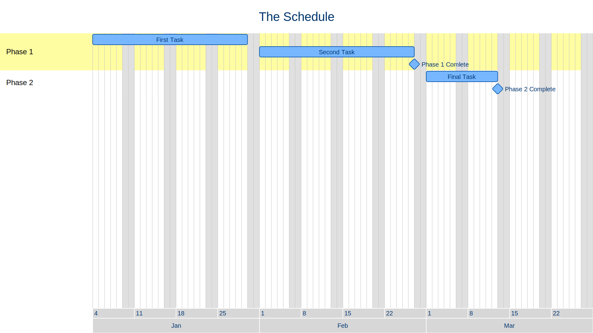

# Dartt

Dartt is a tool for generating Gantt charts from Ruby code.

You can describe your project tasks and milestones with a Ruby internal DSL and generate Gantt chart images.
It focuses on using simple dependencies and task lengths for defining everything, and most of the the chart options and layout are configurable.

Charts are generated as SVG images.

For example, this code:

```ruby
require 'dartt'
require 'date'

Dartt.svg "The Schedule", Date.new(2021, 1, 4), Date.new(2021, 3, 29), "svg-chart" do
    section "Phase 1"
    first_task = task "First Task", start: Date.new(2021, 1, 4), days: 20
    second_task = task "Second Task", after: first_task, days: 20
    milestone "Phase 1 Comlete", after: second_task

    section "Phase 2"
    final_task = task "Final Task", after: second_task, days: 10
    milestone "Phase 2 Complete", after: final_task
end
```

Produces this chart:


## Installation

Add this line to your application's Gemfile:

```ruby
gem 'dartt'
```

And then execute:

    $ bundle install

Or install it yourself as:

    $ gem install dartt

## Usage

TODO: Write usage instructions here

### Creating charts

Create charts by requiring the `dartt` module and using the `svg` function of the module.
The arguments to the `svg` function are:

- `title` - The title of the chart.
- `start_date` - The first day of the chart.
- `end_date` - The last day of the chart.
- `filename` - The name of the svg file to create (do not include the `.svg` extension).

Note: The dates are provided as Ruby `Date` objects, so you will need to `require 'date'` as well.

The `svg` function takes a block will contain the chart.

```ruby
Dartt.svg "The Schedule", Date.new(2021, 1, 4), Date.new(2021, 3, 29), "svg-chart" do 
  # Define your tasks and milestones here.
end
```

### Tasks

### Milestones

### Rendering options

### Custom configuration

## Development

After checking out the repo, run `bin/setup` to install dependencies. Then, run `rake spec` to run the tests. You can also run `bin/console` for an interactive prompt that will allow you to experiment.

To install this gem onto your local machine, run `bundle exec rake install`. To release a new version, update the version number in `version.rb`, and then run `bundle exec rake release`, which will create a git tag for the version, push git commits and tags, and push the `.gem` file to [rubygems.org](https://rubygems.org).

## Contributing

Bug reports and pull requests are welcome on GitHub at https://github.com/[USERNAME]/dartt. This project is intended to be a safe, welcoming space for collaboration, and contributors are expected to adhere to the [code of conduct](https://github.com/[USERNAME]/dartt/blob/master/CODE_OF_CONDUCT.md).


## License

The gem is available as open source under the terms of the [MIT License](https://opensource.org/licenses/MIT).

## Code of Conduct

Everyone interacting in the Dartt project's codebases, issue trackers, chat rooms and mailing lists is expected to follow the [code of conduct](https://github.com/[USERNAME]/dartt/blob/master/CODE_OF_CONDUCT.md).

## TODO

- Make section transparency configurable.
- Individual day highlighting.
- Custom styling for custom tags.
- Automatic chart sizing.
- Reference chart start/end for task dates.
- Allow dependencies on more than one task.
- Dates can be specified as strings instead of objects.

### Errors to handle

- Tasks placed outside chart dates.
- Task and milestone title run off the end of the chart.